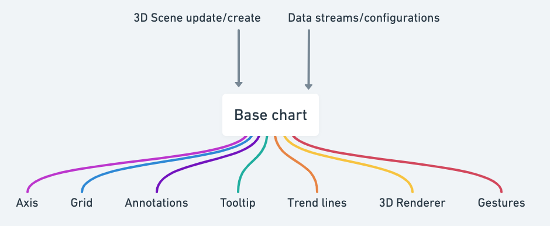
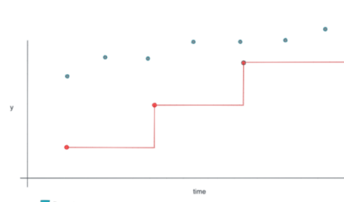

# Base chart

Base chart (which is exposed as the Web component `<sc-webgl-base-chart />`) is a shared component used across the following components:

- line chart
- scatter chart
- bar chart
- heat map
- status-timeline

Base chart provides some common functionality, the primary components of the base chart are

- Managing rendering/updating the 3D Scene
- Rendering axis
- Rendering a grid
- Rendering annotations
- Rendering trend lines. [See example in documentation site](https://synchrocharts.com/#/Features/Trends)
- Managing gestures
- Syncing chart with it's corresponding viewport group. [See example in documentation site](https://synchrocharts.com/#/Features/Synchronization)

## Customizing visualizations
IoT App Kit Visualizations utilizes https://threejs.org/ to manage 3D scenes which represent the visualizations rendered onto a bar chart. For example, to implement the dots within a scatter chart,
We create some code which turns the data points into threejs `3DObjects`, which get rendered as a flat 2D point.

How the base chart exposes the flexibility to create custom chart components, is to allow the passing in of two functions, `createChartScene` and `updateChartScene`. Within these functions,
you are able to construct and manipulate your visualizations that will be rendered onto your visualization component.

## Future plans for additional flexibility

The current design of base chart prevents us from easily mix and matching chart types. For instance, what if we have to be able
to both have a line chart, and a scatter chart, within the same visualization?

In order to allow this greater flexibility in how we visualize our data, we will move over to a 'plugin' architechure, which would
allow for multiple 'visualization plugins' to be utilized simultaneously within a visualization component

_an example of what a plugin base architecture could allow us to build - multiple visualization types within a single component._
